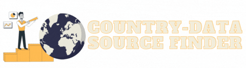

- **Country Data Source Finder** is a search engine web app that helps you finding the best data sources for the country-level statistics you seek. Type what you are looking for in the search bar and get the right data source you need.
- **Features**:
  - Search engine based on semantic transformers model ([SBERT](https://www.sbert.net/))
